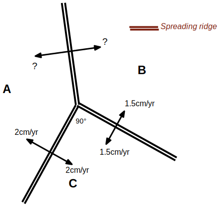

# Calculations

A basic understanding of plate kinematics is helpful in understanding how systems of plates evolve and 
the boundary conditions they apply to the continental crust. It is also important to appreciate that the
"rules" of plate boundary evolution are, in fact, emergent from complicated, multiscale systems. 

You will need to read the notes on plate kinematics (section 2 of module 1) and it will help to have read
John Dewey's “PLATE TECTONICS.” Scientific American 226, no. 5 (1972): 56–72. [10.1038/scientificamerican0572-56](https://doi.org/10.1038/scientificamerican0572-56)

::::{admonition} 2.1 RRR triple junction velocities

*A ridge-ridge-ridge triple junction with half-spreading rates labelled.*

What is the magnitude in cm/yr of the half-spreading rate between plates A & B in the three-plate system in the diagram ?  

Draw a selection of magnetic stripes on this diagram (in the reference frame of the triple junction to make things simple).
::::

