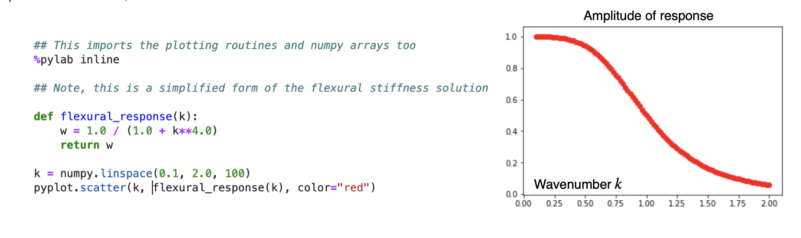

# Calculations

This assessment task is intended to familiarise you with some of the equations that we have seen or will soon see in the lecture notes and typical solutions that are in common use. You are not required to derive the solutions as this is a verification task. When you are asked to show how an equation behaves you can either:

 - *Plot the results using python and following the sample code* 
 
 OR 
 
- *use a traditional curve-sketching approach to indicate maxima / minuima / asymptotic behaviours and how those change with the parameters of the model.*

::::{admonition} Example question

The general differential equation for the deflection of an elastic lithosphere with an end load $P$  and a horizontal load $q(x), is given by

$$D\frac{d^4w}{dx^4} + P \frac{d^2w}{dx^2} + \Delta \rho g w(x) = q(x)$$

If $P=0$ and $q(x)=\rho_c g h_0 \sin(kx)$, show that w=w_0 \sin(kx) is a suitable solution and sketch the value of $w_0$ as a function of $k$ .

::::

::::{admonition} Example Answer
:class: tip

The solution is easy to validate by substitution of the form of $q(x)$ and $w(x)$ into the given equation. And re-arranging to determine that:

$$ w_0=\frac{\rho_c g h_0}{\Delta\rho g + Dk^4}  $$

We can make a plot:

::::

## Biharmonic equation

The biharmonic equation describes two dimensional, incompressible Stokes flow. It is a fourth order PDE written as:

$$\nabla^4 \psi = -Ra \frac{\partial T}{\partial x}$$

For the purposes of this question, we will work in Cartesian coordinates and we will identify solutions to the homogeneous equation, i.e. 

$$
\frac{\partial^4 \psi}{\partial x^4} +
2\frac{\partial^4 \psi}{\partial x^2 \partial y^2} +
\frac{\partial^4 \psi}{\partial y^4} = 0
$$
	
::::{admonition} 3 / 25
   
Show that $\psi_0 = \left( A \cosh ky + B \sinh ky \right) \sin kx$ is a solution. 

::::

As pointed out in Turcotte and Schubert, 2002, we need four independent solutions / coefficients to form a complete set for this equation. The other term they suggest trying is $$\psi_1 = y\psi_0$ . 

::::{admonition} 3 / 25

Validate that $\psi_1$ is an eigenfunction of the biharmonic operator. 

How about $\psi_0 + psi_1$ ?

::::

Note: there are many different forms of the equations given in T&S's book and this really relates to choosing which functions are the best fit to the boundary conditions for the problem and which, as a result, give the simplest expressions.

## Gravity Currents / Lava domes

::::{sidebar} Pancake domes

::::

Pancake lava domes on Venus can be modelled as though they are blobs of viscous lava that spread out after an initial eruption. In a 1982 paper, Huppert found a mathematical expression for the spreading of viscous fluids on a flat surface. The solution assumes either fixed volume or a known injection rate. For a fixed volume, the solution is interesting because it keeps the same shape but just scales horizontally / vertically. 

The solution looks like this:

$$ h(r,t) = \nu_N^{2/3}  t^{-1/4} \phi(\nu/\nu_N) $$

where  $\nu =  r t^{-1 / 8}$ and $\phi({\nu}/{\nu_N}) = \left( \frac{3}{16}\right)^{\frac{1}{3}} 
\left( 1-\left({\nu}/{\nu_N}\right)^2 \right)^{\frac{1}{3}}$.

$\nu_N $ is a constant with a value close to 1. The solution is made up of two parts: a scaling that stretches the shape in the radial direction and shrinks it in the vertical direction as time progresses, and the other part is the shape itself (the function $\phi$).

::::{admonition} 8 / 25

Make a sketch or plot of $h(x)$  at four different values of $t$: 1.0, 10.0, 100.0, 1000.0  
::::

::::{admonition} Hint 
:class: tip

 - This looks a bit complicated but first write a function to compute $\nu(r,t)$ and then a function to compute $\phi(\nu)$. 
 - $\phi(\nu) is only valid if $ 0 < \nu < 1$  so be sure to check and return 0.0 if $\nu$ is outside that range (it will be since you want to plot a region into which the blob begins to spread).

 - Calculate values up to r=4.0. You should see the dome spreading out with time as long as you make sure that the values outside the valid range are properly zeroed out.

::::

## Oceanic Heat Flux

## Lithospheric Flexure