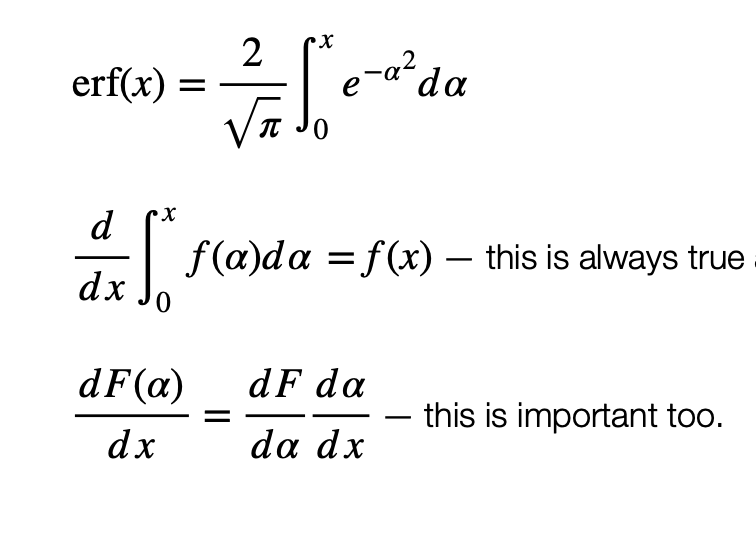
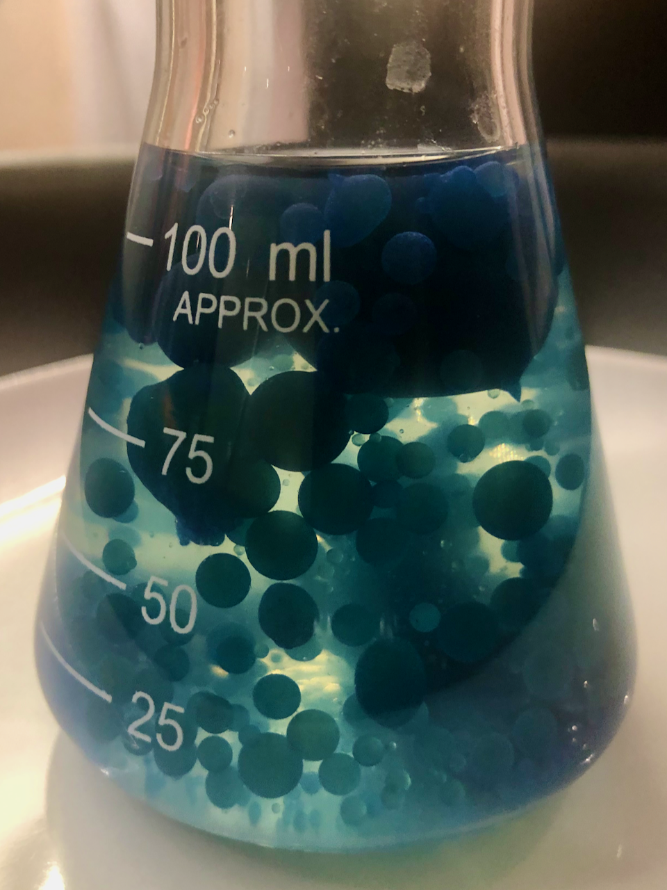

# Practicals and Exercises 

## Map Making

Make maps with cartopy and stripy

DETAILS TBA (Notebooks)

[Worksheet here](Exercises/MapMaking).


## Mathematical Models

```{margin} Models

```

In this exercise, you will be validating solutions to equations, plotting the solutions and exploring some of the examples from the lecture notes. It is assumed that you will be using something like `sympy` or `mathematica` for substitutions into equations and `jupyter` notebooks for writing up and plotting.

Notebooks TBA

[Worksheet here](Exercises/Calculations.md).


## Convection 

```{margin} Convection

```

This is a short set of questions to reinforce some concepts about mantle convection and how it relates to the cooling rate of a planet including oceanic heat flow patterns v. global heat flow averages.
[Worksheet here](Exercises/Convection).


 ## Plate Kinematics

```{margin} Plate Configurations

```

This exercise is in two parts and follows on from the [lecture on plate reconstruction](../Lectures/Lecture_PlateKinematics). 

[The first part of the exercise](Exercises/PlateKinematics1) is to learn how the vector addition rules for flat-Earth plate boundary motions work. This involves computing relative velocities for various different plates with simple (but representative) boundary configurations and solving some straightforward puzzles. These puzzles are not intended to be complicated or difficult but they do help to get you thinking the right way about these kinds of problems. Although written in a flat-Earth context, the principles transfer  to the surface of a sphere with a few small conceptual shifts. 

[The second part of the exercise](Exercises/PlateKinematics2) is a venerable one that dates back to David Gubbins and Mary Fowler and is based on the configuration of plate boundaries in the South-Eastern Pacific Ocean. The original involves drawing a series of updated maps to scale. However, with a little modification, it can be converted to a form that has easy-to-compute vector addition only and that's what I have done for you. 
You will be computing the updated locations of a virtual version the the East Pacific rise and its surroundings and using these to draw sketch maps that show what information from the sea-floor is left behind after the plates are subducted. 


## Thermochemical Convection Models


```{margin} DIY Lava Lamp

```

This exercise is intended to be an at-home practical demonstration of thermo-chemical convection. All the ingredients are commonly available from the supermarket and most of them are everyday kitchen items. You will be making a [Lava Lamp](Exercises/LavaLamp) which will teach you how buoyancy works in thermal convection systems that also have chemically distinct (immiscible) regions. This is an analogue of sorts for the solid Earth and you will gain some intuition for the convective regimes at work inside the planet.

