# PHYS 3070

## Plate Tectonics

  - **Louis Moresi** (convenor)

Australian National University

_**NB:** the course materials provided by the authors are open source under a creative commons licence. 
We acknowledge the contribution of the community in providing other materials and we endeavour to 
provide the correct attribution and citation. Please contact louis.moresi@anu.edu.au for updates and 
corrections._

<--o-->

## Plate Tectonics

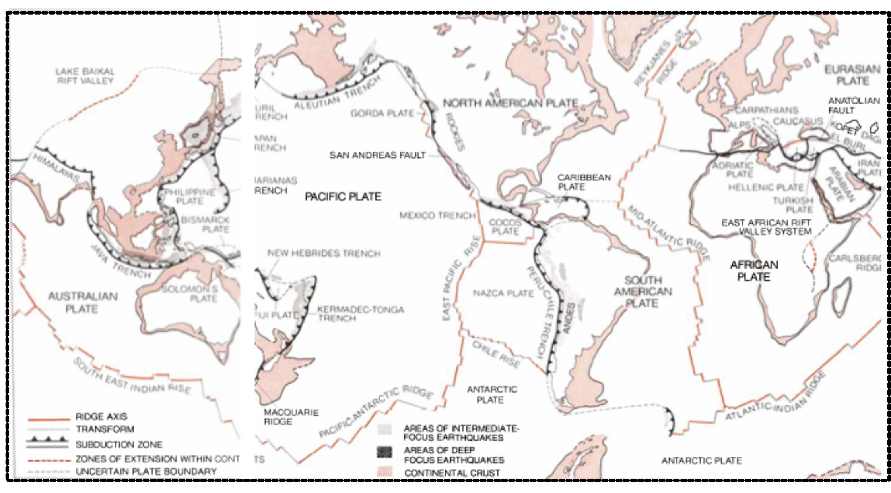 <!-- .element style="width:66%;" -->

This part of the course introduces the concepts of global-scale tectonics, plate motions, the nature of plate boundaries and the geological structures characteristic of large-scale deformation of the crust.

 

<small>

*Dewey, J. F. (1972). PLATE TECTONICS. Scientific American, 226(5), 56–72. https://doi.org/10.1038/scientificamerican0572-56 - a global map of the "Mosaic of Plates [that] forms the Earth's lithosphere or outer shell"*

</small>

<--o-->

## Plate Tectonics (Wikipedia)

 <!-- .element style="float:right; width:30%"-->

Plate tectonics is a scientific theory describing the large-scale motion of the plates making up the Earth's lithosphere since tectonic processes began on Earth *between 3.3 and 3.5 billion years ago*. The model builds on the concept of continental drift, an idea developed during the first decades of the 20th century. The geoscientific community accepted plate-tectonic theory after seafloor spreading was validated in the late 1950s and early 1960s.

The lithosphere, which is the rigid outermost shell of a planet (the crust and upper mantle), is broken into tectonic plates. The Earth's lithosphere is composed of seven or eight major plates (depending on how they are defined) and many minor plates. Where the plates meet, their relative motion determines the type of boundary: convergent, divergent, or transform. 

Earthquakes, volcanic activity, mountain-building, and oceanic trench formation occur along these plate boundaries (or faults). The relative movement of the plates typically ranges from zero to 100 mm annually.

<--o-->

## The Earth in Cross Section

 

 

This image is drawn approximately to scale 

  - The **core** is roughly 1/2 the radius (1/8 volume) and the **inner core** is roughly 1/2 the radius of the core  

  - Most of the Earth (by volume) is the mantle - the *lower mantle* is below 670km  

  - The **oceanic lithosphere** is no more than about 100-150km thick and the **continental lithosphere** can be up to 400km (maybe) thick in cratonic areas  

  - The **continental crust** is a few tens of km thick (exaggerated in the diagram) but the **oceanic crust** is nearly always about 6-7 km thick ... too thin to show !

<--v-->

## The Earth in Cross Section

 

 

The circulation currents in the *solid mantle* move at a few cm/yr and plate motions are 
part of the overall circulation. 

Mantle Plumes are also part of the overall circulation but much smaller than the slabs because 
they are cylindrical rather than sheets. 

Flow in the mantle is broad scale - small structures induce broad flow. 

On a global scale, movement is slow and viscous, especially in the deep mantle. 

<--o-->

## Thickness of the Lithosphere

 <!-- .element style="display:block; margin-left:auto; margin-right:auto; width:60%" -->

This map shows the lithospheric thickness coloured as though it refers to temperature (thin lithosphere is in warm colours, thick is in cool colours) which does have some physical relevance. The greyscale is topography.

<--v-->

## Thickness of the Continental Lithosphere

 <!-- .element style="display:block; margin-left:auto; margin-right:auto; width:60%" -->

A similar map that *contours* the thickest parts of the lithosphere (scale is in km) and leaves out the oceans altogether. 

<--v-->

## Relative thickness of Crust and Lithosphere

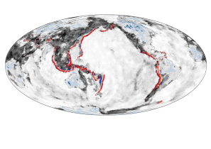 <!-- .element style="display:block; margin-left:auto; margin-right:auto; width:60%" -->

This map shows the relative thickness of the crust and the lithosphere (thick crust is dark). You can immediately see how important the mechanical structure of the lithosphere is when it comes to the response to geological stresses. *The coloured dots are earthquake hypocentres coloured by depth and mostly show where the slabs are located.*

<--o-->

## Global Stress 

 <!-- .element style="float:right; margin-top:50px;margin-bottom:50px; width:50%; margin-left:50px" -->

The World Stress Map (WSM) 2016 displays the contemporary crustal stress orientation in the upper 40 km based on the WSM database release 2016. Lines show the orientation of maximum horizontal stress. The colours indicate whether stresses are:

  - Normal faulting 
  - Strike slip 
  - Thrust faulting

So, already, we can see that the state of stress and deformation style are closely linked. Note that the **magnitude** of the stress is not part of this map.

<--v-->

## Global Seismicity

The magnitude of the stress is related to the rate of seismic energy release because this is a measure of those places which are under enough stress for the lithosphere to "break".

<video autoplay controls width="75%">
    <source src="movies/GlobalEQCumulative.m4v"
            type="video/mp4">

    Sorry, your browser doesn't support embedded videos.
</video>

Usually this takes the form of a fault that already exists sliding because the shear stresses are large compared to the confining pressure.

<--v-->

## Global Strain rate

 <!-- .element style="float:right; margin-top:50px;margin-bottom:50px; width:50%; margin-left:50px" -->

<!-- .element stoyle="width:60%" -->

The strain rate is a measure of how fast deformation is taking place. Strain rate is a measure of the rate of change of length (units are $s^{-1}$) *and* it is a tensor: there are multiple components that represent normal and shear strains. The measure shown here is an average (the second invariant).

The rate of deformation is related to two things: the stress applied and the strength of the material. 

<small>

Kreemer, C., Blewitt, G., & Klein, E. C. (2014). A geodetic plate motion and Global Strain Rate Model. Geochemistry, Geophysics, Geosystems, 15(10), 3849–3889. https://doi.org/10/f6p92p

</small>

<--v-->

## Global Volcanism

 <!-- .element style="width:60%" -->

Volcanic activity is distributed similarly to that of seismicity and mostly occurs at convergent and divergent plate boundaries. There is also a significant level of intra-plate volcanism. Magma pathways within the crust are influenced by the stress field and we can analyse volcanic structures to determine the ambient stress field at the time they were formed.

<small>

Make your own map from the NOAA natural hazards interactive web page: [https://maps.ngdc.noaa.gov/viewers/hazards](https://maps.ngdc.noaa.gov/viewers/hazards/?layers=3)

</small>

<--o-->

## Plate Tectonics (Wikipedia + annotation)

 <!-- .element style="float:right; width:30%"-->

Plate tectonics is a scientific theory describing the large-scale motion of the plates making up the Earth's lithosphere since tectonic processes began on Earth *between 3.3 and 3.5 billion years ago*. The model builds on the concept of continental drift, an idea developed during the first decades of the 20th century. The geoscientific community accepted plate-tectonic theory after seafloor spreading was validated in the late 1950s and early 1960s.

The lithosphere, which is the rigid outermost shell of a planet (the crust and upper mantle), is broken into tectonic plates. The Earth's lithosphere is composed of seven or eight major plates (depending on how they are defined) and many minor plates. Where the plates meet, their relative motion determines the type of boundary: convergent, divergent, or transform. 

Earthquakes, volcanic activity, mountain-building, and oceanic trench formation occur along these plate boundaries (or faults). The relative movement of the plates typically ranges from *zero to 100 mm annually*.

<--o-->

## Discussion points

  1. How can we measure plate motions (now, in the past ?)  
  1. Does plate tectonics really apply to the continents ?
  1. What is the most obvious difference between the response of continental crust and oceanic to 
     mantle forcing ?

We will revisit these questions throughout the course. 

<--o-->

## Global Plate Motions

 <!-- .element style="width:60%; float:right;" -->

This map is the plate motions derived from the NUVEL-1 model in a No-Net-Rotation frame of reference in which the major contienental masses do not move very much. 

  1. We only measure the relative motion of plates relative to one another. 
  2. The speed of the plates can vary even though they are rigid because their motion is described by their **angular velocity** about a pole (Euler pole).

<small>

You can build your own global dataset of plate motions from a UNAVCO website here: [https://www.unavco.org/software/geodetic-utilities/plate-motion-calculator/plate-motion-calculator.html](https://www.unavco.org/software/geodetic-utilities/plate-motion-calculator/plate-motion-calculator.html) and also read more about the models / data themselves.

</small>

<--o-->

## Plate Boundaries

The regions of highest strain rate at the surface of the Earth are the plate boundaries. 

 <!-- .element style="width:66%;" -->

The styles and patterns of deformation are very dependent on the orientation of the stresses that are acting at the boundary. 

<--o-->

## Plate Boundaries

 <!-- .element style="width:66%;" -->

This map includes diagrams of the physical processes that are happening at the smaller scale at each type of plate boundary. 

<small>
World Map of Plate Boundaries, Bonnie Magura (Portland Public Schools) and Chris Hedeen (Oregon City High School) from https://serc.carleton.edu/ANGLE/educational_materials/activities/204690.html
</small>

<--o-->

## Take away points

Do you know the answers to these questions ?

  - Is the mantle solid or liquid ?
     
  - What is the relationship between crust and lithosphere ?
     
  - How fast do the plates move (typically / roughly) ?
     
  - What evidence do we have that plates are "rigid" ? 
     
  - Is plate tectonics really a theory about plates ?
    
    
<--o-->

## Plate Boundaries

The regions of highest strain rate at the surface of the Earth are the plate boundaries. 

 <!-- .element style="width:66%;" -->

The styles and patterns of deformation are very dependent on the orientation of the stresses that are acting at the boundary which is not recorded in this map.

<--o-->

## Plate Boundary Types 

There are three categories of plate boundaries and they are clearly identifiable and distinct:

  - Divergent boundaries where the crust pulls apart and new crust is formed. 
  - Convergent boundaries where the lithosphere and oceanic crust is destroyed
  - Strike-slip boundaries where lateral motion neither creates nor destroys crust

The Earth naturally seems to separate out these different types of boundaries - at least in the oceanic lithosphere. 

**This observation is really quite remarkable, don't you agree ?**

<--o-->

## Plate Boundary Map

 <!-- .element style="width:66%;" -->

This map includes diagrams of the physical processes that are happening at the smaller scale at each type of plate boundary. 

<small>
World Map of Plate Boundaries, Bonnie Magura (Portland Public Schools) and Chris Hedeen (Oregon City High School) from https://serc.carleton.edu/ANGLE/educational_materials/activities/204690.html
</small>

<--v-->

## Plate Boundary Map

 <!-- .element style="width:66%;" -->

The "definitive" map of the plate boundaries is the one from Peter Bird (2003) which identifies (and digitises) the plate boundary segments and categorises them. It even continues into the continental regions where plate boundaries are questionable at best.

<small>

Bird, P. (2003). An updated digital model of plate boundaries: UPDATED MODEL OF PLATE BOUNDARIES. Geochemistry, Geophysics, Geosystems, 4(3). https://doi.org/10/br2s86

</small>

<--o-->

## Divergent Boundaries: Morphology

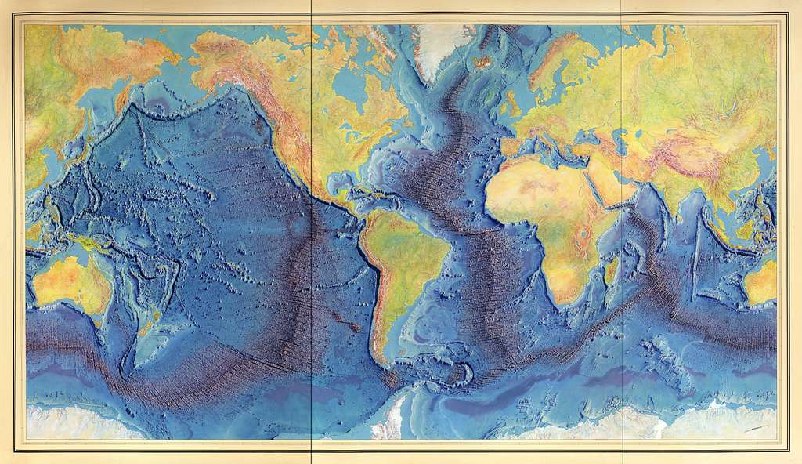   <!-- .element style="width:55%;" -->

The divergent boundaries largely form the global mid-ocean ridge system. This well-known map by Marie Tharp and her colleagues, identified those features as one of the most prominent geological features of the entire planet that had previously been unknown.

<small>

Hand-painted rendition of Heezen-Tharp 1977 ‘World ocean floor’ map, by Heinrich Berann.  Library of Congress, Geography and Map Division, CC BY-ND. See [this article](https://theconversation.com/marie-tharp-pioneered-mapping-the-bottom-of-the-ocean-6-decades-ago-scientists-are-still-learning-about-earths-last-frontier-142451) for some background. 

</small>

<--v-->

## Divergent Boundaries: Morphology

 <!-- .element style="width:66%" -->

Close up view of the Juan de Fuca ridge system showing the rifting morphology

<small>

Canales, J. P., R. S. Detrick, S. M.Carbotte, G. M. Kent, J. B. Diebold, A. J. Harding, J. Babcock, M. R. Nedimović, and E. van Ark (2005), Upper crustal structure and axial topography at intermediate-spreading ridges: seismic constraints from the Southern Juan de Fuca Ridge, J. Geophys. Res., B12104, doi:12110.11029/12005JB003630.

</small>

<--o-->

## Divergent Boundaries: Kinematics

 

<small>

Image derived from Vine (1968)

</small>

The morphology and bathymetry information comes to life when combined with 
the magnetic intensity maps of the mid-ocean ridge system. 

 <!-- .element style="width:70%;" -->

Chaotic magnetic reversal patterns combined with "steady" spreading produces a symmetric stripe-pattern
that reflects the aging of the sea floor.

<--o-->

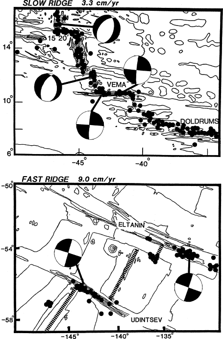 

## Divergent Boundaries: Earthquakes

The focal mechanisms for earthquakes at mid-oceans ridges are indicative of normal faulting.

However, at fast spreading ridges, the high temperatures appear to suppress the normal faulting events. 

   

*If you need a refresher on earthquake focal mechanisms, **track down** to see some more slides.*

<--v-->

## Focal Mechanisms 1

 

The focal mechanism for an earthquake tells you how the ground moved during an event. For earthquakes on 
faults (and assuming that they are small enough to consider to be a point at teleseismic distance), the pattern cuts space into 4 segments defined by the fault plane and a second, orthogonally crossing plane (auxilliary plane).

When the seismic signal arrives, the first motion will either be towards or away from the source. 

*We can demonstrate that easily in a lecture room !*

<small>

Diagrams: [wikipedia (Mike Norton)](https://en.wikipedia.org/wiki/Focal_mechanism)

</small>

<--v-->

## Focal Mechanisms 2

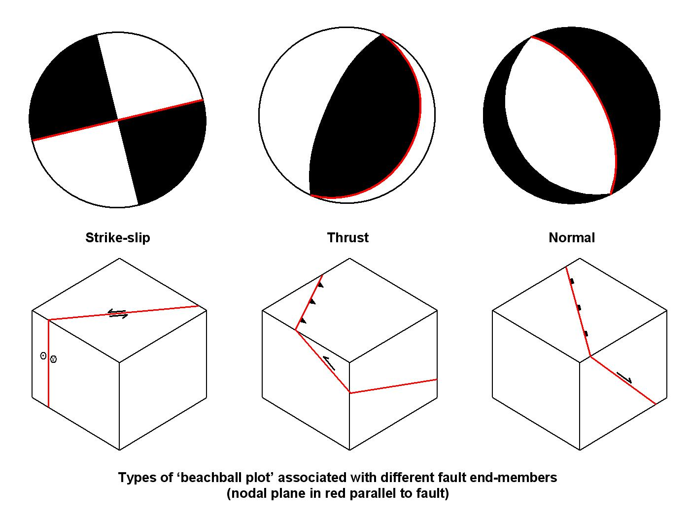 

The "beachball" mechanism immediately tells you the orientation of the fault / slip although there is an ambiguity between the slip / auxilliary planes and the sense of slip. 

This is a representation of a tensor quantity known as the **moment tensor** for the event which contains information about the slip magnitude and orientation. 

Here we are assuming a double-couple mechanism (which assumes no volume change) and this is a simplification of observed moment tensors.

<small>

Diagrams: [wikipedia (Mike Norton)](https://en.wikipedia.org/wiki/Focal_mechanism)

</small>

<--v-->

## Focal Mechanisms 3

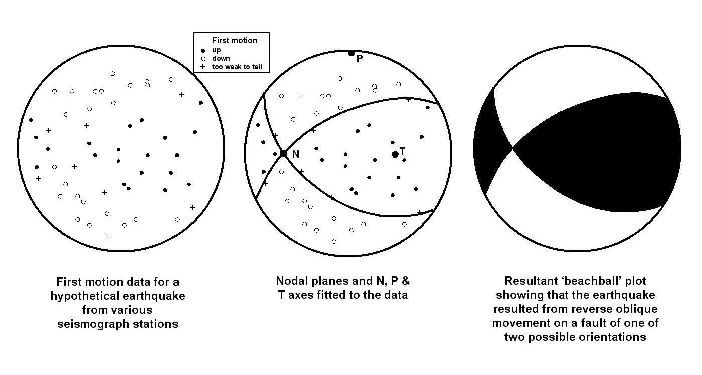 

We would ideally treat the focal mechanism as an unknown to be solved by predicting the waveforms of the seismic signals recorded at various instruments distributed around the event. 

Alternatively, first motions are plotted on a sterographic projection, differentiated by whether the ground moved up or down (the "first motion"), and two orthogonal great circles are drawn to separate the up and down motions into 4 quadrants. Black is used for the compressional or up quadrants.  

The beach ball is assumed to reflect the orientations of the stresses that drive the slip.  
These principal stresses are shown with the P, T, and N points, which represent three orthogonal vectors. 

<small>

Diagrams: [wikipedia (Mike Norton)](https://en.wikipedia.org/wiki/Focal_mechanism)

</small>

<--v-->

## Focal Mechanisms ... confusing terminology

This table shows you the problem:

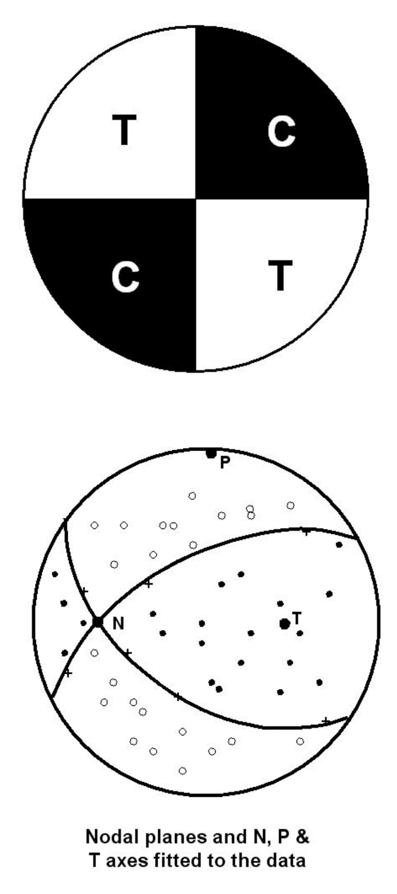 <!-- .element style="height:600px; float:right; margin-left:30px;" -->

Terminology   | Abbreviation  | Representation
------------- | ------------- | ---------
Compressional Motion | $\mathbf{C}$ (or $\color{red}{\mathbf{P}}$)  |  Dark Shading
Tensional Motion     | $\color{red}{\mathbf{T}}$                    |  Light / White Shading
Pressure Axis              |  $\color{red}{\mathbf{P}}$      |  A point in the *light* region
Tensional Axis             |  $\color{red}{\mathbf{T}}$    |  A point in the *dark* region
Neutral Axis               |  $\color{black}{\mathbf{N}}$    | Where the planes cross and $\perp$ to **P** and **T**
Maximum principal stress   |  $\sigma_1$ |  A point in the *light* region
Intermediate principal stress | $\sigma_2$   | $\perp$ to $\sigma_1$ and $\sigma_3$
Minimum principal stress  | $\sigma_3$                      |  A point in the *dark* region

$\sigma_1$ and **P** are usually similar, so are $\sigma_3$ and **T**, $\sigma_2$ and **N**
but they are not expected to align exactly because faults do not form at / align to 45$^\circ$ to the principal stresses.

<--o-->

## Divergent Boundaries: Summary 

 <!-- .element style="width:66%" -->

The cross section of a ridge showing four important factors: 

  1. The sense of movement, perpendicularly away from the ridge axis
  1. Topography that becomes deeper away from the ridge
  1. A partial melt zone that is tapped to form the ocean crust close to the axis
  1. Age of crust formation and depth correlated (square root of age relationship)

<--o-->

## Transform Boundaries: Morphology / Distribution

 <!-- .element style="width:75%" -->

As we already saw, transform boundaries in the ocean are often found offsetting mid-ocean ridges and they
leave scars across the ocean floor that are no longer active as *plate boundaries*. 

<small>

Hensen, C., Duarte, J. C., Vannucchi, P., Mazzini, A., Lever, M. A., Terrinha, P., et al. (2019). Marine Transform Faults and Fracture Zones: A Joint Perspective Integrating Seismicity, Fluid Flow and Life. Frontiers in Earth Science, 7, 39. https://doi.org/10/ghs2k4

</small>
<--v-->

## Transform Boundaries: Morphology

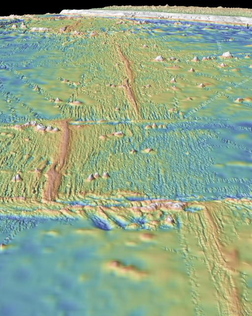 

**Location:** East Pacific Rise, Pacific ocean

**Lat:** 7° N; **Lon:** 103° to 104° W

**Scale (width):** 160 km 
**Data:** Shipboard multibeam bathymetry data

**Description:** Looking north along the East Pacific Rise toward the west coast of Mexico. The North American plate is to the right (east) of the rise. The Pacific plate is to the left (west). 
Shipboard multibeam bathymetry provides this closeup 3D view of the ocean floor. The seafloor seems out of focus in areas where there is no high-resolution bathymetry data available.

**Credit:** [GeoMappApp](http://www.geomapapp.org/gallery/Midoceanridgesgallery.html)

<--v-->

## Transform Boundaries: Morphology

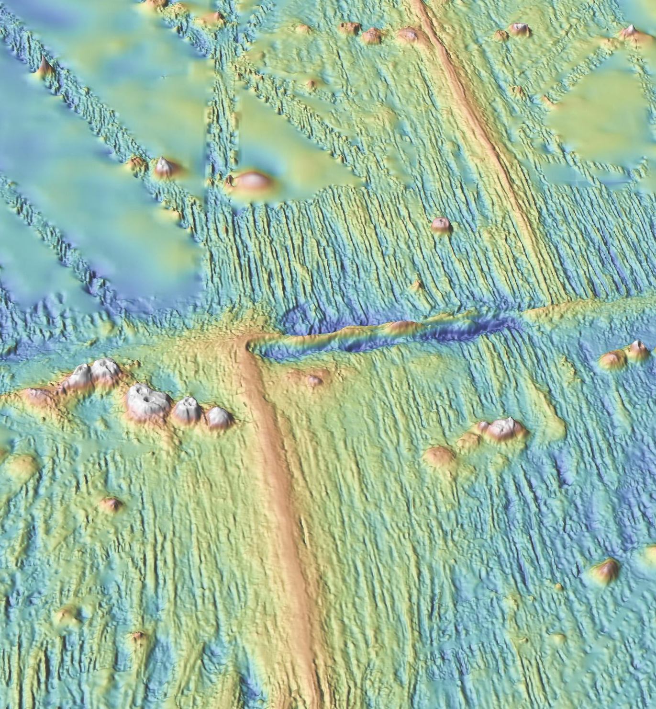 

**Location:** East Pacific Rise, Pacific ocean

**Lat:** 9°-11° N; **Lon:** 104° W

**Scale (width):** 250 km 
**Data:** Shipboard multibeam bathymetry data

**Description:** Perspective view looking north along the East Pacific Rise toward a prominent transform fault running to the east. The North American plate is to the right (east) of the rise. The Pacific plate is to the left (west). 

**Credit:** [GeoMappApp](http://www.geomapapp.org/gallery/Midoceanridgesgallery.html)

<--o-->

## Tranform Boundary: Earthquakes

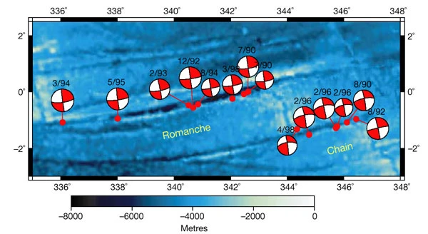 <!-- .element style="width:50%" -->

Map of the equatorial Mid-Atlantic Ridge, showing the Romanche and Chain transform faults and bathymetry.

The depth of seismic slip on oceanic transform faults is controlled by temperature and is limited by the ,600 8C isotherm. The focal mechanisms of earthquakes of the two transform faults show impressive consistency, indicating that the faults are highly planar.

<small>

Abercrombie, R. E., & Ekström, G. (2001). Earthquake slip on oceanic transform faults. Nature, 410(6824), 74–77. https://doi.org/10/c8ptph

</small>

<--o-->

## Transform Boundary: Kinematics

 <!-- .element style="height:350px; margin-right:50px" -->
 <!-- .element style="height:350px; " -->

Planform of MOR with offset shows the relative motions of the two types of boundary. The tranform faults are small circles about the Euler pole that separates the plates and they are *orthogonal* to the spreading centres. 

<--v-->

## Transform Boundary: Fracture Zone Formation

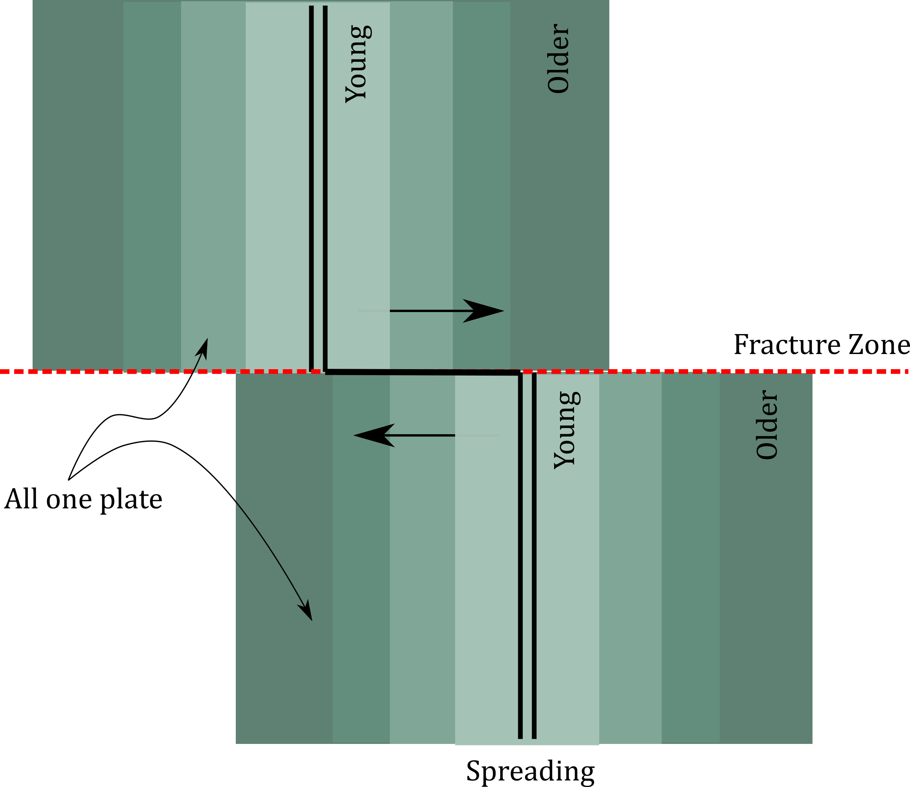 <!-- .element style="height:350px; " -->

The age of the oceanic crust changes across a transform fault which means that there is a difference
in the depth on either side as well. This is also true of the fracture zone where there is an age offset even though either side of the fracture zone is the same plate.

<--o-->

## Partitioning of Plate Motions 

 <!-- .element style="width:40%;float:right; margin-left:50px;" -->

There are times when plate motion and the plate boundary orientation are not consistent with the simple picture we painted of the kinematics. This happens in the Gulf of California.

For example, here is what happens when a transform fault is subject to some extensional motion. 

It becomes a *"leaky transform"* which is actually a staircase structure of transform faults and short lengths of spreading.

<small>

National Parks Service, modified from “Earth: Portrait of a Planet, by S. Marshak, 2001, W. W. Norton & Comp., New York. See [Plate Tectonics & Our National Parks](https://www.nps.gov/subjects/geology/plate-tectonics.htm).

</small>

<--o-->

## Convergent Boundaries & Kinematics

Convergent boundaries in the oceanic setting are the subduction zones or trenches where the oceanic lithosphere is recycled into the mantle. 

 <!-- .element style="width:60%;" -->

The geometry of transforms and ridges is very strongly related to the direction of plate motion. If you look closely, though, this map shows that the planform of a subduction zones is not as tightly linked to the plate motion. 

<--v-->

## Convergent Boundaries & Kinematics

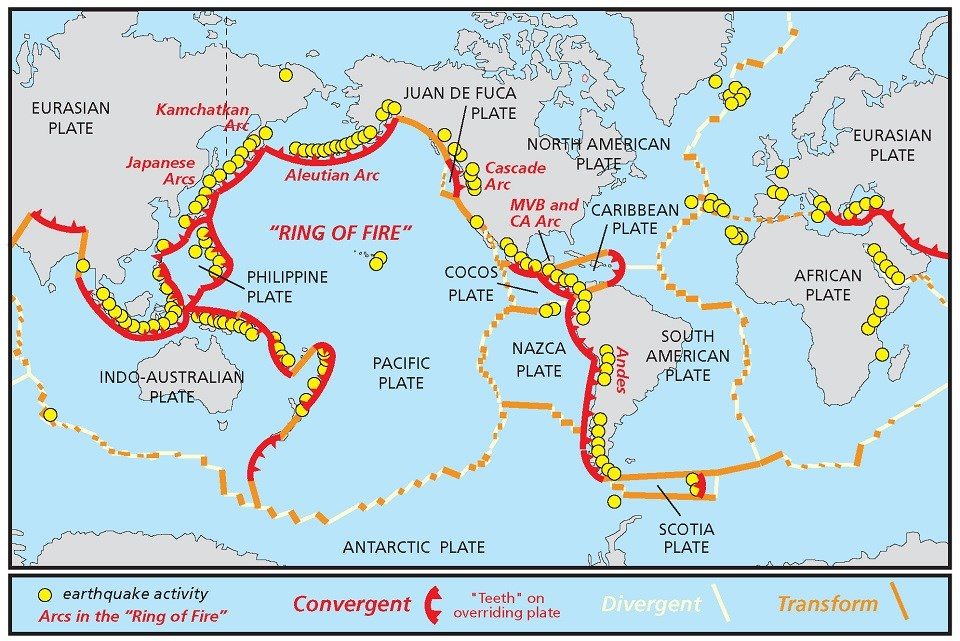 <!-- .element style="width:66%;" -->

This map might be clearer: the trenches are **curved** (and the volcanoes are found as chains or island **arcs**). The plate motion vector has to be oblique to the trench at most points along its length. 

<--v-->

## Slab Rollback

It is more complicated than just this. When we consider the relationship between plate boundary motion and plate motion at trenches, we have to account for **trench rollback**

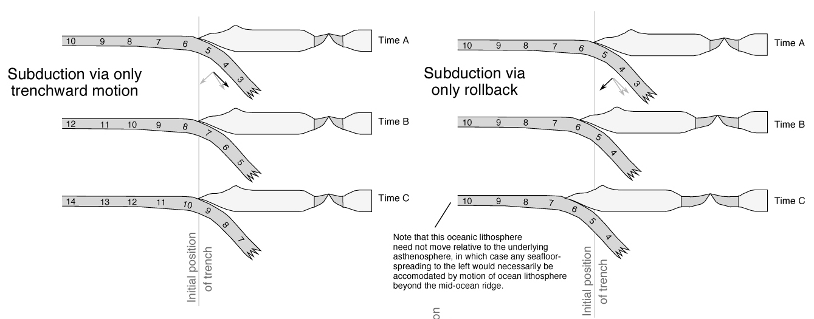 <!-- .element style="width:75%;" -->

Although the motion of the two plates is the same, the motion into the mantle is very different and this is important at convergent margins where the slab and the mantle interact strongly. *It is important to know that this is possible when reconstructing plate motions.*

<small>

Image from [Bruce Railsback, UGA](https://geology.uga.edu/directory/people/bruce-railsback)

</small>

<--v-->

## Slab Rollback

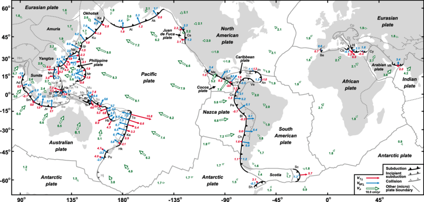 <!-- .element style="width:75%;" -->

This map tries to put all the information together for subduction zones: plate motions, rollback rates and the convergence rate. The most obvious thing about this map is that it is not a simple pattern.

<--o-->

## Subduction Zone Structure

Subduction zones, though they are plate boundaries are inherently 3D structures. 

 <!-- .element style="width:66%;" -->

Here we can see bathymetry from arc to trench to outer-rise superimposed on a cartoon to show what lies under the surface. This is the Tonga-Kermadec subduction zone and you can see where a sea-mount chain is being subducted.

<--v-->

## Subduction Zone Structure

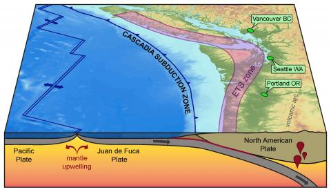 <!-- .element style="width:75%;" -->

This is the Juan de Fuca plate subducting under Cascadia drawn to show the scale of the mantle 
lithosphere relative to the surface geology.

<--v-->

## Subduction Zones in 3D

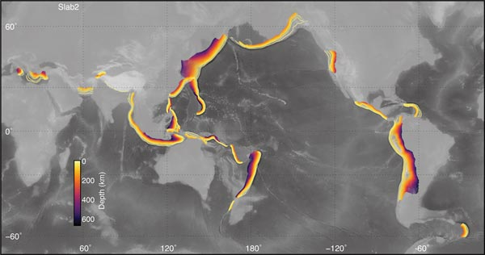 <!-- .element style="width:75%;" -->

The Slab 2.0 global model of subduction zone geometry.

<small>

Hayes, G. P., Moore, G. L., Portner, D. E., Hearne, M., Flamme, H., Furtney, M., & Smoczyk, G. M. (2018). Slab2, a comprehensive subduction zone geometry model. Science, 362(6410), 58–61. https://doi.org/10/gd4q9n

</small>

<--o-->

## Subduction Zone Nomenclature

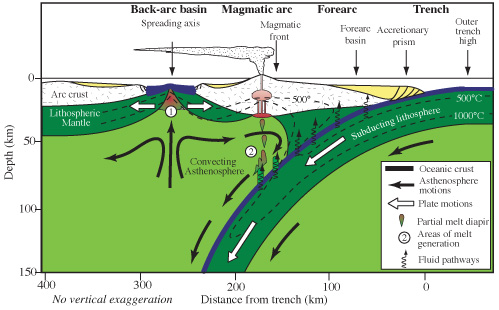 <!-- .element style="width:75%;" -->

The mechanics of a subduction zone is dominated by the bending of the two plates during the locked phase of the megathrust zone and the unbending when the megathrust fails. 

<small>

Image credit: [Wikipedia](https://commons.wikimedia.org/wiki/File:Cross-section_of_a_subduction_zone_and_back-arc_basin.jpg)

</small>

<--o-->

## Subduction zone stresses

The slab is a continuation of the oceanic lithosphere that is bent at the trench and then straightens again in the mantle. The bending is driven by the weight of the slab, mantle stresses, and the contact with the over-riding plate (the megathrust).

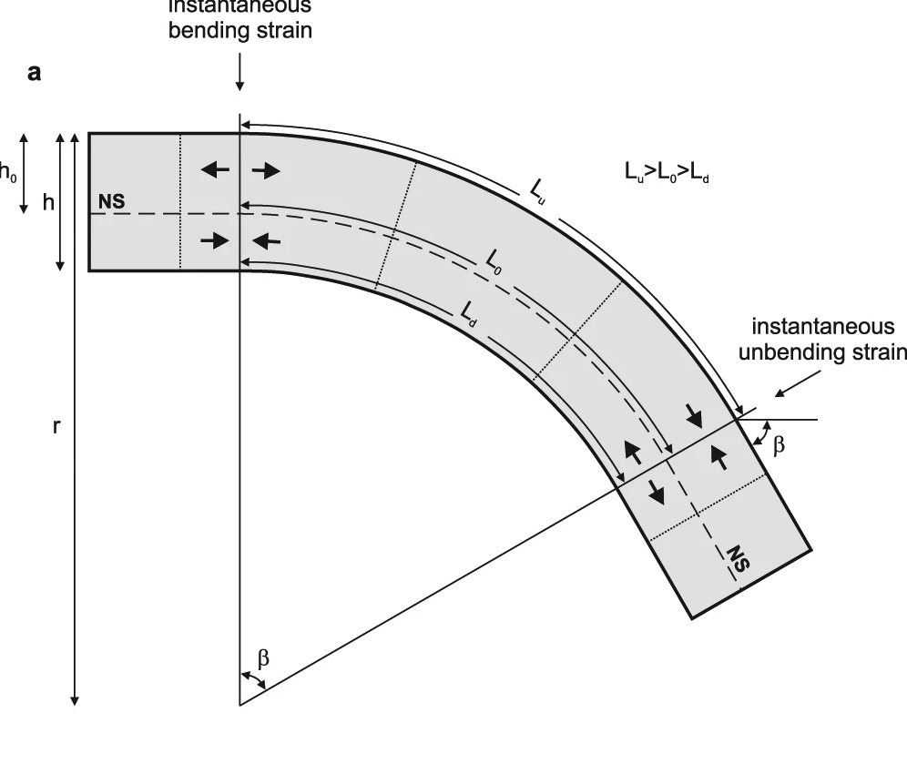 <!-- .element style="width:40%" -->

The lithosphere is stretched in the outer part of a bend and compressed in the inner part. 

<--v-->

## Subduction zone stresses

This leads the formation of an *outer rise* where normal faults are often seen, despite the overall convergent environment.

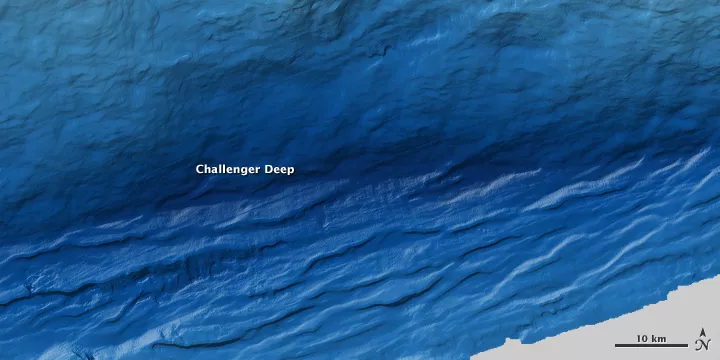 <!-- .element style="width:66%" -->

Here the normal faults are clearly visible in the downgoing plate at the Marianas trench. 

<--v-->

## Subduction zone stresses

These normal faults act as fluid conduits into the crust.

 <!-- .element style="width:66%" -->

This mechanically-driven hydration of the oceanic crust needs to be considered when trying to understand the global fluid cycle of material into trenches and into the base of the arc. This may also influence the seismicity in the slab.

<--o-->

## Plate Bending / Unbending Stresses

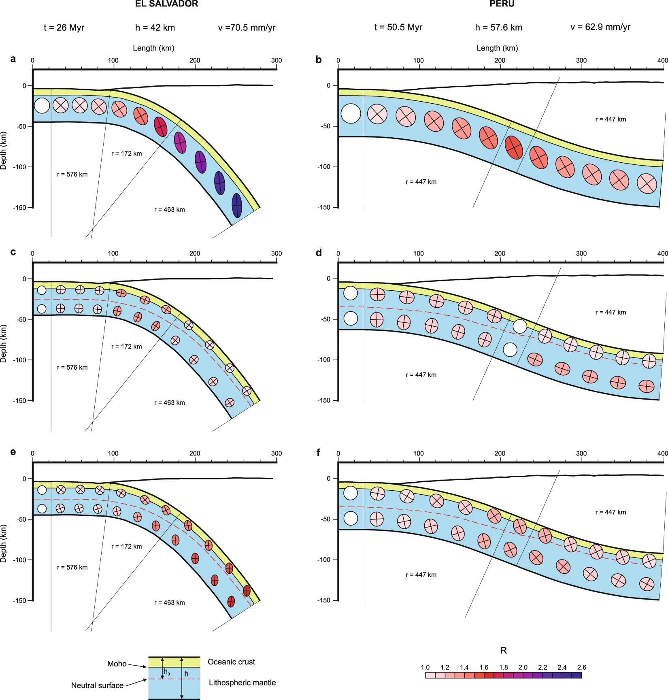 <!-- .element style="width:50%;float:right;margin-left:50px;" -->

 

The stress state of the downgoing plate is related to bending strains *(elastic)* or strain-rates *(viscous)*. The balance between viscous and elastic behaviour is not well understood and probabably varies within the slab (e.g. effects of temperature, faulting).

If the deformation is elastic then the shape completely determines the stresses (Hooke's law).

The diagram on the right shows this: the elastic stresses in a slab that bends, then unbends, vanish in the region where the slab straightens out.

<--v-->

## Plate Bending / Unbending Stresses

 <!-- .element style="width:66%;" -->

If the slab is *viscous*, the change of shape is associated with stress and a very different set of
stresses is predicted. 

<small>

Sandiford, Dan, 2019 (PhD Thesis, University of Melbourne)

</small>
<--v-->

## Plate Bending / Unbending Stresses

 <!-- .element style="width:66%;" -->

This is a computational model that predicts the stresses due to slab bending and also the formation / propagation of faults.

<small>

Sandiford, Dan, 2019 (PhD Thesis, University of Melbourne)

</small>

<--o-->

## Stresses / Bending in the Overriding Plate

 <!-- .element style="width:66%" -->

This diagram shows how the dragging of the downgoing plate can bend the over-riding plate. It also shows why this is so important: the upper-plate also rebounds after a great earthquake and this is the part above sea level where there is often a significant population.

<small>

Rajendran, C. P., Rajendran, K., Andrade, V., & Srinivasalu, S. (2013). Ages and relative sizes of pre-2004 tsunamis in the Bay of Bengal inferred from geologic evidence in the Andaman and Nicobar Islands: AGES AND SIZES OF PRE-2004 TSUNAMIS. Journal of Geophysical Research: Solid Earth, 118(4), 1345–1362. https://doi.org/10/f42dp2

</small>

<--v-->

## Stresses / Bending in the Overriding Plate

 <!-- .element style="height:350px;margin-right:30px;" -->
 <!-- .element style="height:350px;margin-left:30px;" -->

This is readily observable in the uplift signal that we can measure with gps.

<small>

*Review paper on this topic:* Govers, R., Furlong, K. P., van de Wiel, L., Herman, M. W., & Broerse, T. (2018). The Geodetic Signature of the Earthquake Cycle at Subduction Zones: Model Constraints on the Deep Processes: Megathrust Earthquake Cycle From GNSS. Reviews of Geophysics, 56(1), 6–49. https://doi.org/10/gdfxsv

</small>
<--o-->

## Convergent Margin Seismicity

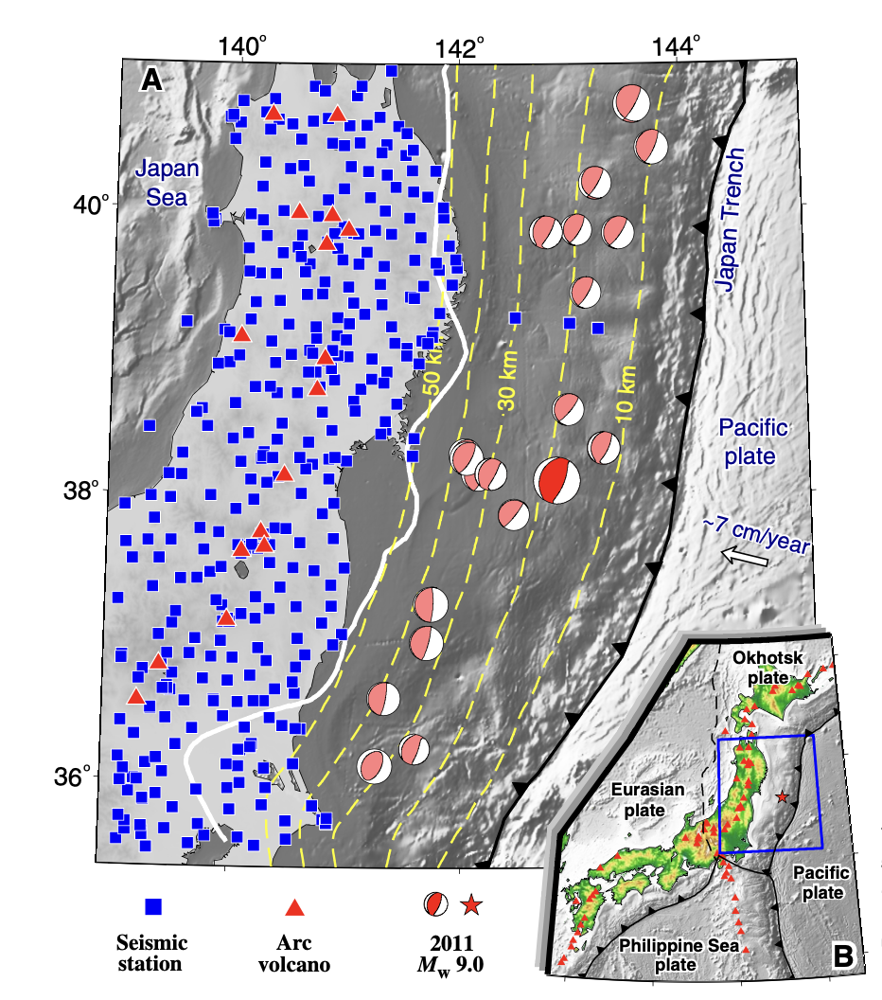 <!-- .element style="width:40%; float:right; margin-left:50px;" -->

The complexity of subduction zones means that there is a whole array of common failure modes, but the 
primary one is an earthquake on the megathrust.

The red beach ball is the focal mechanism of the great 2011 Tohoku-oki earthquake (Mw 9.0), and the pink beach balls denote focal mechanisms of other megathrust earthquakes (Mw ≥ 7.0) during 1917 to 2017. The white line marks the downdip limit of interplate seismicity (2). The yellow dashed lines denote depth contours of the top of the Pacific Plate. Blue squares are seismic stations.

<small>

Liu, X., & Zhao, D. (2018). Upper and lower plate controls on the great 2011 Tohoku-oki earthquake. Science Advances, 4(6), eaat4396. https://doi.org/10/gdsbbk

</small>

<--v-->

## Outer Rise Earthquakes

 <!-- .element style="height:350px;margin-right:30px;" -->
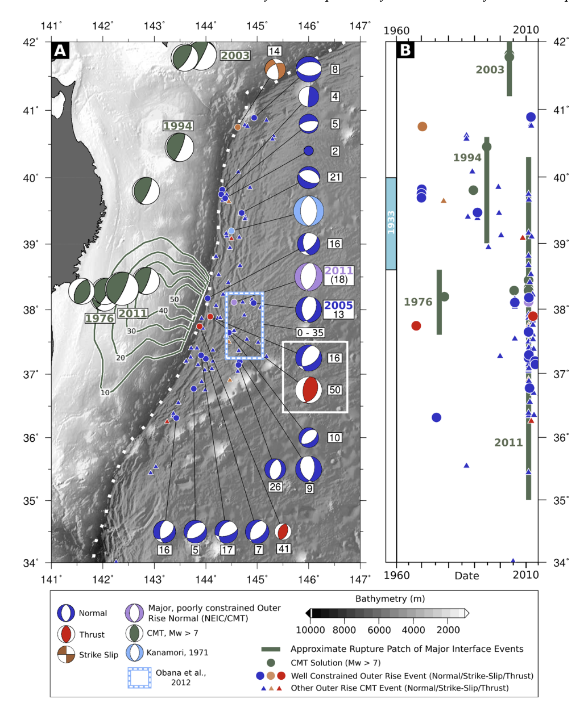 <!-- .element style="height:350px;margin-left:30px;" -->

Outer rise Earthquakes are predominantly normal faulting events caused by the extensional stresses in the upper part of the bending lithosphere. 

<--v-->

## Upper plate seismicity

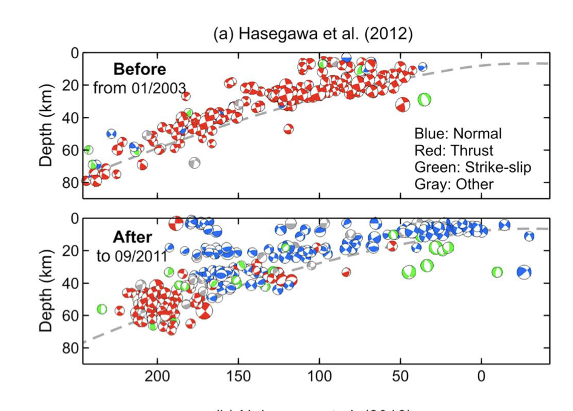 <!-- .element style="width:50%" -->

The upper plate is nothing if not complicated ...
Perhaps the most striking observation is this from Wang et al, which shows the extent to which the upper plate is controlled by the lower plate and the megathrust. Earthquake mechanisms before and after the great Tohoku earthquake of 2011.

<small>

Wang, K., Brown, L., Hu, Y., Yoshida, K., He, J., & Sun, T. (2019). Stable Forearc Stressed by a Weak Megathrust: Mechanical and Geodynamic Implications of Stress Changes Caused by the M = 9 Tohoku‐Oki Earthquake. Journal of Geophysical Research: Solid Earth, 124(6), 6179–6194. https://doi.org/10/gg28pc

</small>

<--o-->

## Topical Case Study

A magnitude 8.2 earthquake struck 50 miles south of the Alaska Peninsula on July 28, 2021 at 10:15 pm local time (July 29, 2021 06:15 UTC). Seismic instruments indicate the earthquake originated at a depth of 20 miles (32.2 kilometers). 

[USGS News Page / Analysis](https://www.usgs.gov/news/magnitude-82-earthquake-alaska)

The earthquake occurred as the result of thrust faulting at shallow depth on the subduction zone interface between the Pacific plate and the North America plate, where the Pacific plate begins subducting to the northwest beneath Alaska.

Large earthquakes in this region are common; the same subduction zone hosted the second largest earthquake recorded on modern instrumentation in March 1964 (M9.2 Alaska earthquake), and in 1938 a M8.2 event occurred in a very similar location to today's earthquake. 

<--o-->

## Triple Junctions

In any *interesting* configuration of plates there have to be places that three plates meet. These are known as **triple junctions** and the kinematic rules of plate boundary motion constrain the movement (even existence) of each type of triple junction quite severely.

<small>

Desa, M. A., Ramprasad, T., & Kamesh Raju, K. A. (2019). An integrated geophysical study east of the southern Chagos Laccadive Ridge Complex, Central Indian Ocean Basin: Implications for the Rodriguez Triple Junction dynamics in the Late Cretaceous. Marine Geology, 414, 47–63. https://doi.org/10/gmc8s5

</small>

<--v-->

## Triple Junction Stability

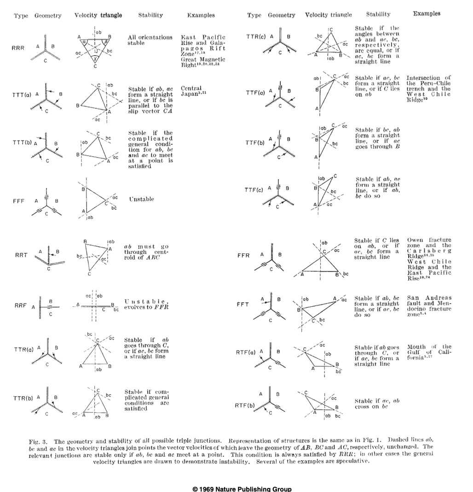

Many configurations of three plate boundaries meeting are unstable (i.e. it is difficult to imagine how they could form, and they either lock up or change to something else).

Three ridges are always stable, many configurations of trench, ridge and transform. But some, such as three transforms are impossible.

McKenzie and Morgan enumerated **all** the possibilities (right)

<small>

McKenzie, D. P., & Morgan, W. J. (1969). Evolution of Triple Junctions. Nature, 224, 125–133.

</small>

<--v-->

Triple junctions appear in Lava lakes - mostly ridge-ridge-ridge examples because there is no close analogue to a subduction zone in a lava lake.

<iframe width="560" height="315" src="https://www.youtube.com/embed/ybMekPyvq9Y?start=10" title="YouTube video player" frameborder="0" allow="accelerometer; autoplay; clipboard-write; encrypted-media; gyroscope; picture-in-picture" allowfullscreen></iframe>

*April 17, 2021: The lava lake in Halema‘uma‘u Crater, at the summit of Kīlauea Volcano, remains active. This video is shown at 20x speed and shows the lava supplying the lake from the western fissure.*

<--o-->

## Continental v. Oceanic Plate Boundaries

 <!-- .element style="width:60%; float:right;" -->

This map is the plate motions derived from the NUVEL-1 model in a No-Net-Rotation frame of reference in which the major contienental masses do not move very much. 

The strain rate is similar to the global strain rate map but is saturated so that you can see the continental deformation patterns.

<--v-->

## Continental v. Oceanic Plate Boundaries

<video autoplay controls width="75%">
    <source src="movies/GlobalEQRolling5years.m4v"
            type="video/mp4">

    Sorry, your browser doesn't support embedded videos.
</video>

This animation is the seismicity over the years from 1975 to 2020 plotting on a rolling five year window and coloured according to depth (0 in red, 500km in blue).

<--o-->

## Complexity of Continental Boundaries

  

In the continental setting, plate boundaries are softened because the contiental crust is weaker 
and buoyant. It tends to deform, thicken / thin in response to applied stresses.

  - Basins, rifts need to thin the crust / lithosphere considerably before
    a new oceanic spreading system forms.

  - Mountain belts form in shortened crust as gravitational energy from subduction is
    stored as gravitational potential energy in topography (surface and moho)

<small>

Jolivet, L., Faccenna, C., Becker, T., Tesauro, M., Sternai, P., & Bouilhol, P. (2018). Mantle Flow and Deforming Continents: From India‐Asia Convergence to Pacific Subduction. Tectonics, 37(9), 2887–2914. https://doi.org/10/gfjqxh

</small>

<--o-->

## Himalayan Regional Tectonics 

 <!-- .element style="width:60%;" -->

This is a close-up of the strain rate in the Himalayas -- a collision zone which we can also think of as a convergent plate boundary that has been entirely congested by continental crust.

In continental regions, the processes that are responsible for creating the distinct types of plate boundaries in the oceans are masked by the thick, buoyant crust but we still apply a similar set of tools
(and usually have the advantage of an accessible surface).

<--v-->

## Himalayan Regional Tectonics 

  

The expression might be complicated, but the mechanics of this deformation is quite simple to
first order: shortening of a soft material by a strong indentor with a strong block to the West and a tectonically open boundary on the East.

Convergence is driven by a combination of plate forces from the Indo-Australian plate formation and subduction beneath the Indonesian arc system. 

The crust responds in a classic *Escape Tectonics* geometry which reflects the fact that it is not possible to thicken crust forever: it will eventually collapse sideways under its own weight.

<small>

Jolivet, L., Faccenna, C., Becker, T., Tesauro, M., Sternai, P., & Bouilhol, P. (2018). Mantle Flow and Deforming Continents: From India‐Asia Convergence to Pacific Subduction. Tectonics, 37(9), 2887–2914. https://doi.org/10/gfjqxh

</small>

<--o-->

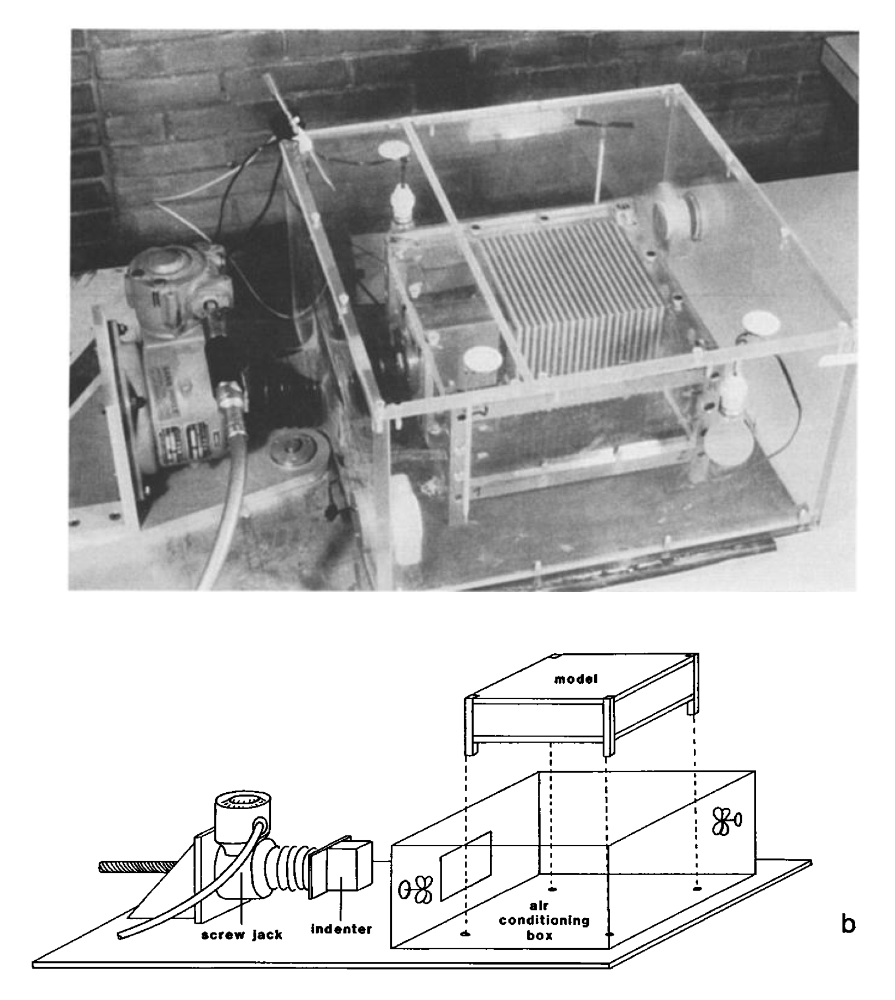

## Models (Analogue)

Analogue models (like the sandbox) have elastic, plastic and viscous behaviour if you can choose the material and the time-scales correctly.

<small>

Peltzer, G., & Tapponnier, P. (1988). Formation and evolution of strike-slip faults, rifts, and basins during the India-Asia Collision: An experimental approach. Journal of Geophysical Research: Solid Earth, 93(B12), 15085–15117. https://doi.org/10/b853mv

Tapponnier, P., Peltzer, G., Dain, A. Y. L., Armijo, R., & Cobbold, P. (n.d.). Propagating extrusion tectonics in Asia: New insights from simple experiments with plasticine, 6. https://doi.org/10/bmzcmt

</small>

<--v-->

## Models (Analogue)

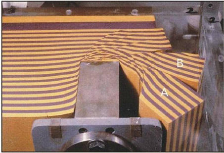 <!-- .element style="height:350px;" -->
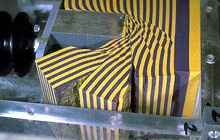 <!-- .element style="height:350px;" -->

<small>

Tapponnier, P., Peltzer, G., Dain, A. Y. L., Armijo, R., & Cobbold, P. (n.d.). Propagating extrusion tectonics in Asia: New insights from simple experiments with plasticine, 6. https://doi.org/10/bmzcmt

</small>

<--v-->

## Models (Computational)

<iframe width="600" height="450" src="https://www.youtube.com/embed/-yCSSvXM5DQ?start=0" title="YouTube video player" frameborder="0" allow="accelerometer; autoplay; clipboard-write; encrypted-media; gyroscope; picture-in-picture" allowfullscreen></iframe>

Computational models include buoyancy forces and elastic/viscous/plastic material behaviour.

<small>

Moresi, L., Betts, P. G., Miller, M. S., & Cayley, R. A. (2014). Dynamics of continental accretion. Nature, 508(7495), 245–248. https://doi.org/10/f5wvpf

</small>

<--v-->

## Models (Computational)

<iframe width="600" height="450" src="https://www.youtube.com/embed/m1ySNUmglPY?start=0" title="YouTube video player" frameborder="0" allow="accelerometer; autoplay; clipboard-write; encrypted-media; gyroscope; picture-in-picture" allowfullscreen></iframe>

Computational models include buoyancy forces and elastic/viscous/plastic material behaviour.

<small>

Moresi, L., Betts, P. G., Miller, M. S., & Cayley, R. A. (2014). Dynamics of continental accretion. Nature, 508(7495), 245–248. https://doi.org/10/f5wvpf

</small>

<--o-->

## Triple Junctions on Land 

 <!-- .element style="width:75%" -->

[KMZ file](data/AfarDepression.kmz) to pinpoint the location of the Afar Depression (10 $^\circ$ 48'25.48" N  41 $^\circ$ 34'16.10")

<!--
## Summary of Module 2
-->
