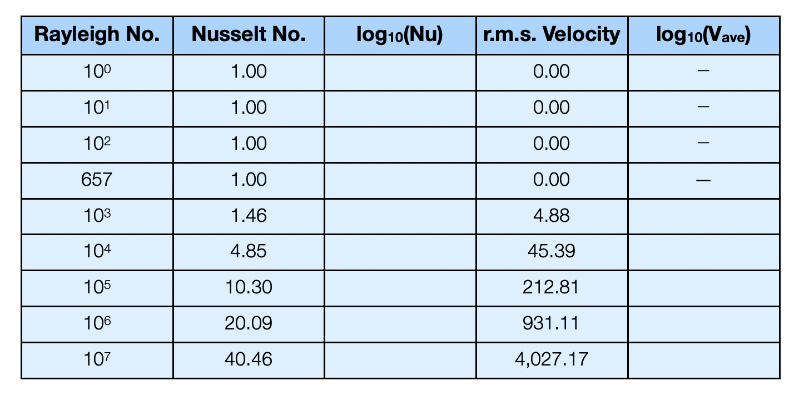

# Convection

This exercise tests your understanding of "simple" Rayleigh-Bénard convection in a layer

## Multiple choice

::::{admonition} 1 / 15

Assume the relationship between convective and conductive heat transfer given in the lectures:				

$$ Q = Q_c \left( \frac{g \rho \alpha \Delta T d^3}{\kappa \eta} \right)^{1/3} $$

Which of the following statements about the efficiency of heat transfer in a convecting layer is / are true ? 

 1. Convection occurs even if the fluid is stationary 	  
 2. Convection cannot occur in zero gravity 	  
 3. The more viscous the fluid, the more efficient convection is at transferring heat	  
 4. The heat transfer when a fluid is convecting is higher than if the fluid was stationary	  
 5. 1 & 3 are both correct 	  
 6. 2 & 4 are both correct 	  
::::

---

::::{admonition} 1 / 15

Viscous deformation in the mantle occurs through:
 1. molecular reorganization of liquid mantle rocks	  
 2. defects migrating through solid rock 	  
 3. fluid infiltration of grain boundaries	  
 4. propagation of brittle fractures	  
 5. competition between diffusion of heat and stress 	  

::::

---

::::{admonition} 1 / 15

Which of the following statements about thermal convection is false ?

1. thermal boundary layer thickness increases with increasing Rayleigh number	  
2. all other things being equal, convection is more vigorous when the viscosity is lower	  
3. in constant viscosity convection, hot &cold thermal boundary layers are the same thickness	  
4. higher Rayleigh number convection has more time variability	  
5. 1 & 4 	  
6. 1 & 3 	  

::::

<!-- -->

:::{sidebar} Goldilocks 

“It says in the paper today that Lord Kelvin’s come up with yet another estimate for the age of the Earth, dearest. This time he’s got the Earth cooling conductively from an initial uniform state ...” said Papa Bear thoughtfully. “I think he would be better treating it as a Stefan problem,” Mama Bear replied, ”otherwise there won’t have been sufficient time for us to evolve language, physics and unfashionable smoking jackets.”
:::

## Planetary Cooling

Three physicists lived together in a little house in the woods. They were Papa Bear, Mama Bear, and Baby Bear. One day when their porridge was too hot to eat, they decided to go for a walk while it cooled off. At around this time, Goldilocks wanders past and thinks it is a smart idea to go inside the bears’ house without permission. The first thing Goldilocks saw was the porridge cooling on the table. “Oh my, I’m hungry,” she thought to herself. She tasted the porridge in the biggest bowl but it was too hot. Then she tasted the porridge in the medium-sized bowl, but it was too cold. Last she tasted the porridge in the littlest bowl and it was just right so she ate it all up. 

But wait ! There appears to be something unusual going on in the bears’ house (Figure) ... 

::::{admonition} 7 / 15

Explain why, on the face of things, the cooling of the porridge in this Goldilocks tale is surprising. 

Give a brief overview of the mechanisms by which solid planets typically cool, including the dominant sources of their internal heat and discuss how this relates to the size of the system.

This is the temperature solution for the plate cooling model.

$$	T = T_0 + (T_m - T_0) \left[ \frac{z}{z_{\mbox{plate}}} + 
	\frac{2}{\pi} \sum_{n=1}^{\infty} \frac{1}{n}
	 \exp \left( -\frac{\kappa n^2 \pi^2 t}{z^2_{\mbox{plate}}} \right) 
	\sin\left( \frac{n\pi z}{z_{\mbox{plate}}} \right) \right]
$$

 - How is surface heat flux related to the temperature profile of the lithosphere ? 
 - Derive an expression for the surface heat flux in this case 

::::

## Nu - Ra etc

Assuming that the heat flow (Nusselt number) and average (root mean square) velocity are related to Rayleigh number in the following way:

$$ Nu = A \cdot \mathrm{Ra}^\alpha \quad\quad V_\mathrm{rms} = B \cdot \mathrm{Ra}^\beta $$

::::{admonition} 5 / 15

Find the values of $\alpha$ and $\beta$ (e.g. by plotting a graph of log10(Nu) against log10(Ra) using the data from the table below.  Standard sort of thing, I'm sure you know the drill) — are these close to the expected theoretical values ?

::::

